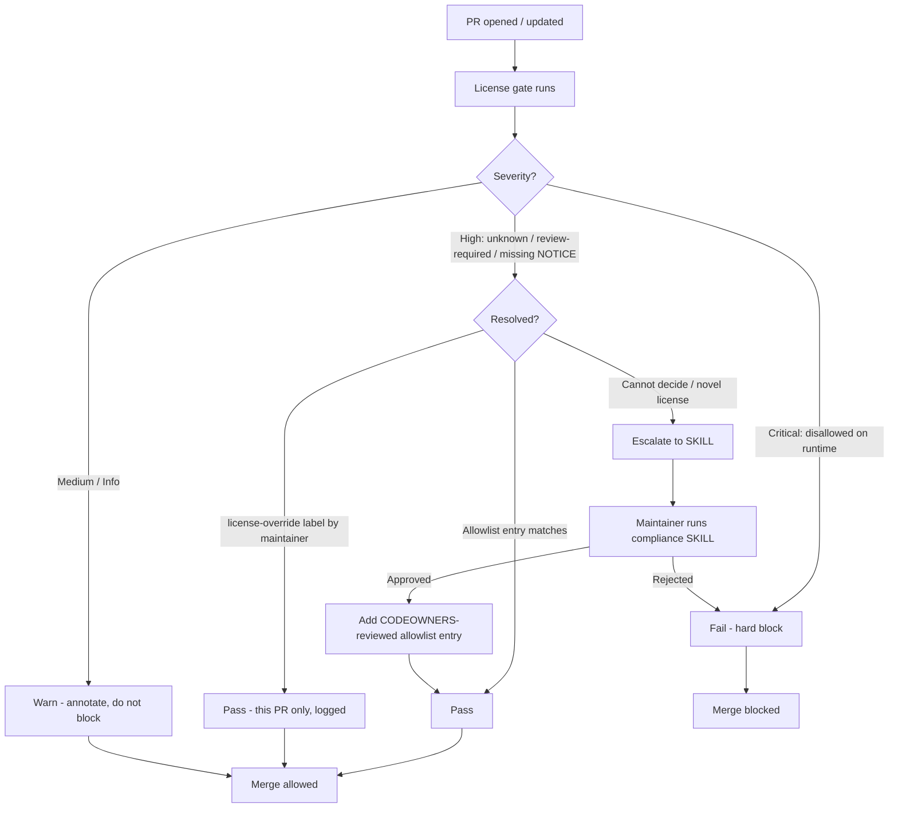

# License / compliance CI gate — design doc

This document specifies how the existing license / compliance **SKILL**
(today: an agent-driven, human-invoked checklist) becomes an automated
**CI gate** on Tier-1 repos. It was the Q2 design deliverable; the gate
itself is built and rolled out in Q3.

> **Status: v0 (implemented).** The reusable workflow
> [`.github/workflows/public-reusable-license.yml`](../.github/workflows/public-reusable-license.yml)
> and its classifier [`.github/scripts/license-policy.mjs`](../.github/scripts/license-policy.mjs)
> are committed, with a negative regression self-test
> ([`license-self-test-negative.yml`](../.github/workflows/license-self-test-negative.yml))
> and an end-to-end smoke self-test
> ([`license-self-test.yml`](../.github/workflows/license-self-test.yml)).
> The Q3 implementation ticket ("License / compliance enforced in CI on
> Tier-1 — SKILL becomes fallback") owns this workflow plus the consumer
> wiring and the telemetry-gated Tier-1 rollout. See
> [Usage (v0 implementation)](#usage-v0-implementation) for how to consume
> it. The rest of this document remains the spec that the implementation
> follows.

> **Sign-off.** The v0 rollout is **warn-only** (shadow mode) on the first
> Tier-1 repo, so it annotates without blocking; flipping any consumer to a
> required blocking check still needs **Olu (TL)** sign-off (see
> [Sign-off](#sign-off)) once shadow-mode telemetry is in.

## Contents

- [Goal](#goal)
- [Background: from SKILL to gate](#background-from-skill-to-gate)
- [Where this sits](#where-this-sits)
- [What the gate checks](#what-the-gate-checks)
- [Fail vs warn matrix](#fail-vs-warn-matrix)
- [Exception flow](#exception-flow)
- [Fallback to the SKILL](#fallback-to-the-skill)
- [Rollout sequencing](#rollout-sequencing)
- [Usage (v0 implementation)](#usage-v0-implementation)
- [Implementation outline (Q3 scope)](#implementation-outline-q3-scope)
- [Out of scope](#out-of-scope)
- [Open questions](#open-questions)
- [Sign-off](#sign-off)

## Goal

Make license / NOTICE / compliance enforcement on PRs **deterministic and
automatic** on Tier-1 repos, so that:

1. A disallowed license (e.g. AGPL, SSPL) reaching a runtime/shipped path
   **fails the PR** before merge — not after, and not by relying on a
   human remembering to run a checklist.
2. Shipped third-party code and models carry the **required attribution
   (NOTICE)**.
3. Newly added (including transitively pulled) dependencies whose licenses
   we have not yet reviewed are **surfaced and blocked** until a human
   reviews them.
4. The human SKILL is reserved for the cases the gate genuinely cannot
   decide (novel licenses, judgement calls), and its decisions are
   recorded so the gate learns them.

The gate is **primary**; the SKILL is the **fallback**.

## Background: from SKILL to gate

Today, license/compliance review on a PR depends on a contributor or
reviewer invoking the compliance SKILL — an agent-driven checklist that
walks a human through "did we add a dependency, what's its license, do we
ship it, did we add the NOTICE". This works but is:

- **Opt-in.** It runs only when someone remembers to run it.
- **Non-blocking.** Nothing stops a PR from merging if the checklist was
  skipped.
- **Not auditable.** There is no durable record on the PR that the check
  was performed and what it concluded.

The Q3 plan flips this: CI runs the deterministic checks on every PR; the
SKILL becomes the escalation path for the long tail the gate punts on.

## Where this sits

License/compliance is the **third pillar** of PR-time supply-chain /
safety enforcement in this org, alongside the two that already exist:

| Pillar | Covers | Mechanism | Status |
| --- | --- | --- | --- |
| `sfw-guard` (Socket Firewall) | Supply-chain at **install time** | [`.github/actions/sfw-guard/action.yml`](../.github/actions/sfw-guard/action.yml) | Live |
| Security baseline (TruffleHog + CodeQL) | Secrets + static analysis on **source** | [`docs/security-baseline.md`](security-baseline.md), [`.github/workflows/public-reusable-security.yml`](../.github/workflows/public-reusable-security.yml) | v0 drafted |
| **License / compliance (this doc)** | **License legality + attribution** of deps & shipped artifacts | reusable workflow (Q3) + SKILL fallback | Design |

The license gate is intentionally modeled on the security baseline: a
single reusable workflow consumed by Tier-1 repos via one `uses:` line,
producing a required status check and a single upserted PR comment.

## What the gate checks

Three independent check groups. Each maps to a severity in the
[matrix](#fail-vs-warn-matrix).

### 1. License policy (allowed vs disallowed)

Every dependency's resolved SPDX license is classified against a policy
list:

- **Disallowed (deny):** strong-copyleft / network-copyleft and
  source-available licenses that are incompatible with how we ship —
  e.g. `AGPL-3.0`, `SSPL-1.0`, `GPL-3.0` / `GPL-2.0` on a runtime path,
  `BUSL-1.1`, `CC-BY-NC-*`.
- **Allowed (allow):** permissive licenses safe to ship — e.g. `MIT`,
  `Apache-2.0`, `BSD-2-Clause`, `BSD-3-Clause`, `ISC`, `0BSD`,
  `Unlicense`. (This repo already ships `MIT` and `Apache-2.0` license
  texts under [`hyperbee-models-server/license/`](../hyperbee-models-server/license).)
- **Review-required:** weak-copyleft and custom/community licenses that
  are situational — e.g. `LGPL-*`, `MPL-2.0`, and AI model community
  licenses such as **Llama-3.2** and **Qwen** (both already present under
  [`hyperbee-models-server/license/`](../hyperbee-models-server/license)).
  These are field-of-use / redistribution restricted and need a human to
  confirm our usage complies.
- **Unknown:** no detectable SPDX identifier, or a license string the
  scanner cannot map.

The **runtime vs dev distinction matters**: a copyleft license on a
`devDependencies`-only / build-time tool is far lower risk than the same
license on a shipped runtime dependency. The gate distinguishes the two
(see [matrix](#fail-vs-warn-matrix)).

### 2. Required attribution (NOTICE)

For third-party code and **models** that we **ship**, the gate verifies
the corresponding attribution/license text is present.

This is grounded in the existing model-packaging flow:
[`hyperbee-models-server/drive.js`](../hyperbee-models-server/drive.js)
copies a license into each model drive via `copyLicenseFiles(licenses,
modelDir)`, reading `license/<name>/LICENSE.txt` and writing
`LICENSE-<name>.txt` into the artifact. A model drive config declares its
licenses (e.g. `license: ["MIT"]`).

The gate checks that:

- Every shipped third-party component (dependency or model) that requires
  attribution has its NOTICE/license text included in what ships.
- A model/artifact declaring a license actually carries the matching
  license file (the `LICENSE-<name>.txt` invariant above).
- A license that mandates "preserve copyright / NOTICE" (e.g.
  `Apache-2.0`, BSD family) is not shipped without it.

> Auto-*generating* the NOTICE file is **out of scope** here (separate Q3
> ticket). This gate only *verifies presence/consistency*; it does not
> create the NOTICE.

### 3. Lockfile drift / transitive licenses

Added dependencies pull transitive dependencies, which inherit licenses we
must inspect. On each PR the gate:

- Diffs the lockfile(s) (`package-lock.json`, `npm-shrinkwrap.json`,
  `yarn.lock`, `pnpm-lock.yaml`, etc.) `base..head`.
- Resolves the license of **every newly added or version-changed package**
  (direct and transitive), not just the top-level change.
- Classifies each against the policy in check group 1.

This catches the common failure mode where a benign-looking direct
dependency drags in an AGPL transitive dependency.

## Fail vs warn matrix

The gate assigns each finding a severity. Severity determines the PR
outcome.

| Severity | Condition | Outcome | Override path |
| --- | --- | --- | --- |
| **Critical** | Disallowed license added to a **runtime / shipped** path (dependency or model) | **Fail** (hard block) | None — must remove/replace, or change policy via CODEOWNERS PR |
| **High** | License **unknown** or **review-required and not yet reviewed**; OR a shipped component is **missing required NOTICE/attribution** | **Fail** | Allowed — [exception flow](#exception-flow) (allowlist entry / `license-override` label) |
| **Medium** | Disallowed/weak-copyleft license on a **dev/build-only** path; lockfile changed a transitive license within already-allowed set in a way worth noting | **Warn** (annotate, do not block) | n/a (informational) |
| **Informational** | Allowed-license dependency added/updated; NOTICE present and consistent | **Warn / summary only** | n/a |

### Worked examples

These use real components in this repo to make the rules concrete.

| Scenario | Group | Severity | Outcome |
| --- | --- | --- | --- |
| A PR adds an `AGPL-3.0` package to a runtime dependency of a shipped service | License policy | **Critical** | **Fail** — blocked, no override |
| A PR ships a model under **GNU-V3 (GPL-3.0)** (present in [`license/GNU-V3`](../hyperbee-models-server/license)) on a runtime/distribution path | License policy | **Critical** | **Fail** — blocked |
| A PR adds a dependency whose license the scanner **cannot detect** (Unknown) | License policy | **High** | **Fail**, override via allowlist after human review |
| A PR ships a **Llama-3.2** model but the field-of-use terms have not been reviewed for this use | License policy (review-required) | **High** | **Fail**, override via allowlist after TL/CODEOWNERS review |
| A PR adds an `Apache-2.0` model/dep but **omits** the `LICENSE-Apache-2.0.txt` / NOTICE that `copyLicenseFiles` would include | Attribution | **High** | **Fail** until NOTICE added (or allowlisted with justification) |
| A PR adds a `GPL-3.0` **build-only** CLI used in CI but never shipped | License policy (dev path) | **Medium** | **Warn** — annotated, not blocked |
| A PR bumps an existing **MIT** dependency; transitive set still all-permissive | Lockfile drift | **Informational** | **Warn / summary** — not blocked |

Severity thresholds (which severities fail) are a **workflow input** so a
repo can tighten over time, mirroring the security baseline's
`severity-threshold` knob — see
[Implementation outline](#implementation-outline-q3-scope). The defaults
above are the recommended Tier-1 starting point.

## Exception flow

Some High findings are legitimately fine (a reviewed custom license, a
dependency we have decided to accept). The exception flow makes that
decision **explicit, attributable, and durable** — never a silent skip.

### Where the allowlist lives

A YAML allowlist committed **in the consumer repo**, mirroring the
TruffleHog allowlist pattern from the security baseline
(`allowlist-path: .github/trufflehog-allowlist.yml`). Proposed location:
`.github/license-allowlist.yml`, passed to the workflow via an
`allowlist-path` input.

```yaml
# .github/license-allowlist.yml
# Each entry records a deliberate, reviewed acceptance of a license finding.
approvals:
  - package: "some-dep"          # or model name / artifact id
    version: ">=1.2.0 <2.0.0"    # scope of the approval
    license: "MPL-2.0"
    scope: runtime               # runtime | dev | model
    reason: "Weak copyleft; we use unmodified, dynamically linked. Reviewed."
    approved_by: "@olu"          # maintainer who approved
    reviewed_on: "2026-06-15"
    pr: "tetherto/<repo>#1234"   # PR where the decision was made
    expires: "2027-06-15"        # optional re-review date
```

The gate treats a finding as resolved **only** when a matching allowlist
entry exists; otherwise it stays a High fail.

### Who can add to it (CODEOWNERS)

The allowlist path is protected by `CODEOWNERS` so that adding/editing an
entry **requires review by an authorized owner**. This reuses the existing
approval machinery in
[`.github/workflows/approval-check-worker.yml`](../.github/workflows/approval-check-worker.yml),
which already reads `.github/CODEOWNERS` and recognizes the
`ai-runtime-merge` (team lead) and `ai-runtime-merge-mgmt` (management)
teams plus the repo-owning team.

```text
# .github/CODEOWNERS (consumer repo)
/.github/license-allowlist.yml   @tetherto/ai-runtime-merge
```

So an allowlist change is gated by a TL (or the repo-owning compliance
owners), not self-served by the PR author.

### Override label (fast path)

For a one-off acceptance that does not yet warrant a permanent allowlist
entry, a maintainer may apply a `license-override` PR label, mirroring the
existing `tier2` / `verify` label conventions used by
[`.github/workflows/public-pr.yml`](../.github/workflows/public-pr.yml)
and the approval worker. The gate then downgrades the targeted High
finding to a warn **for that PR only**, and the workflow records who
applied the label in the PR comment. The label is intended as a
stop-gap; the durable record is the allowlist entry.

### Auditable trail

Every exception leaves a durable, reviewable record:

- The **allowlist commit** (who, when, justification, scope) in repo
  history.
- The **CODEOWNERS-required PR review** approving that commit.
- The **PR comment** the workflow upserts, naming the finding, the
  resolution (allowlisted vs label override), and the approver.
- The **status check** history on the commit.



## Fallback to the SKILL

The gate is deterministic: it can only decide cases its policy and
scanners cover. When it **cannot** decide, it must not silently pass and
must not hard-fail with no recourse — it **escalates to the human SKILL**.

Escalation triggers:

- A **novel license** with no SPDX mapping and no policy classification.
- A **review-required** license (e.g. a new model community license) on a
  shipped path with no allowlist entry.
- A genuine judgement call (field-of-use / redistribution terms) the
  policy cannot encode.

Mechanics:

1. The gate marks the finding **High → fail** and writes a PR-comment line
   explaining *why it punted* and linking the SKILL: "Cannot classify
   `<license>` for `<component>`. Run the compliance SKILL and record the
   decision in `.github/license-allowlist.yml`."
2. A maintainer runs the **compliance SKILL** (the same checklist that is
   the primary mechanism today) to make the call.
3. The decision is recorded back into the **allowlist** (approve) or the
   dependency is removed/replaced (reject). The allowlist edit goes
   through CODEOWNERS review.
4. On re-run, the gate now finds the matching allowlist entry and the
   check is **deterministic from then on** — the SKILL is not needed again
   for that component/version.

This is the precise sense in which "SKILL becomes fallback": it handles
only the long tail, and each invocation feeds the gate's knowledge so the
tail shrinks over time.

## Rollout sequencing

Conservative, telemetry-gated rollout — same philosophy as the security
baseline's "drafted, then per-repo enable" approach.

1. **Pick one Tier-1 repo first.** Choose a Tier-1 repo with an active but
   moderate PR volume and a clear owning team in `CODEOWNERS` (so the
   exception flow has real owners). The model-shipping surface in
   [`hyperbee-models-server`](../hyperbee-models-server) makes a
   models-adjacent repo a strong first candidate because it exercises both
   dependency-license and attribution/NOTICE paths.
2. **Run in warn-only (shadow) mode first.** Land the workflow with all
   severities downgraded to warn (or as a non-required check) for ~1-2
   weeks to measure noise without blocking anyone.
3. **Capture telemetry before enabling blocking** (see below).
4. **Flip to blocking** (required status check in branch protection) once
   the false-positive rate is acceptable and the team is trained on the
   exception flow.
5. **Only then expand** to the next Tier-1 repo. Org-wide rollout beyond
   Tier-1 is explicitly out of scope for Q3.

### Expected friction

- **Transitive-license false positives / unknowns** on the first run
  (large existing dependency trees surface lots of "unknown" the first
  time). Mitigation: warn-only shadow period + seed the initial allowlist.
- **First-run latency** while the scanner builds the dependency/license
  inventory.
- **Owner bandwidth** for the CODEOWNERS-gated allowlist reviews early on.

### Telemetry to capture (gate before expanding)

| Metric | Why | Target before expanding |
| --- | --- | --- |
| **False-positive rate** | Is the gate trustworthy? | Low enough that blocking is not resented (set concrete target at sign-off) |
| **Time-to-resolve** a blocking finding | Does the exception flow actually unblock people quickly? | Hours, not days |
| **Override frequency** (`license-override` label use) | Is the policy too strict, or being bypassed? | Trending down as allowlist matures |
| **SKILL escalation rate** | How big is the long tail? | Trending down |
| **Findings by severity / group** | Where is the noise concentrated? | Used to tune policy/thresholds |

## Implementation outline (Q3 scope)

Outline only — enough to scope the Q3 ticket, not the implementation.

- **Shape:** a reusable workflow, e.g.
  `.github/workflows/public-reusable-license.yml`, consumed by Tier-1
  repos with one `uses:` line, exactly like
  [`public-reusable-security.yml`](../.github/workflows/public-reusable-security.yml).
- **Engine A — dependency licenses + lockfile drift:** GitHub-native
  [`actions/dependency-review-action`](https://github.com/actions/dependency-review-action),
  which already supports `allow-licenses` / `deny-licenses` and runs
  scoped to the PR diff. Primary mechanism for check groups 1 and 3.
  Requires the repo's Dependency Graph to be enabled.
- **Engine B — shipped third-party / model attribution:** an SBOM /
  license scanner over the source tree and shipped artifacts (candidates:
  `licensee`, `scancode-toolkit`, or Syft-generated SBOM) to verify
  NOTICE/license presence per check group 2 — including the
  `LICENSE-<name>.txt` invariant from
  [`drive.js`](../hyperbee-models-server/drive.js). Final tool choice is a
  Q3 decision.
- **Inputs (mirroring the security baseline's input style):**
  - `allow-licenses` / `deny-licenses` — policy lists (sensible org
    defaults baked in).
  - `allowlist-path` (default `.github/license-allowlist.yml`) — exception
    file.
  - `fail-severity` — lowest severity that fails the job (default per the
    [matrix](#fail-vs-warn-matrix)); supports the warn-only shadow mode.
  - `paths-include` / `paths-exclude` — scope, and to express runtime vs
    dev path classification.
  - `enable-pr-comment` (default `true`) — single upserted PR comment.
- **Outputs / UX:** a job-summary table plus one upserted bot PR comment
  listing findings, severities, and resolution hints — reusing the
  comment-upsert pattern already used in
  [`approval-check-worker.yml`](../.github/workflows/approval-check-worker.yml)
  and the security baseline.
- **Gating:** registered as a **required status check** in the Tier-1
  repo's branch-protection ruleset, joining the existing checks driven by
  [`public-pr.yml`](../.github/workflows/public-pr.yml).
- **Permissions:** `contents: read`, `pull-requests: write` (comment).
  No write to code.
- **Self-test (optional, recommended):** a negative self-test in this repo
  that plants a known-disallowed license fixture and asserts the gate
  fails, mirroring `security-self-test-negative.yml`.

## Usage (v0 implementation)

The v0 gate ships as the reusable workflow
[`public-reusable-license.yml`](../.github/workflows/public-reusable-license.yml).
It mirrors the security baseline's consumer shape: one `uses:` line, a
job-summary table, and a single upserted PR comment. On PRs it enumerates
the dependency diff via
[`actions/dependency-review-action`](https://github.com/actions/dependency-review-action),
then classifies every added dependency with
[`license-policy.mjs`](../.github/scripts/license-policy.mjs) against the
allow / deny / review policy, the consumer's exception allowlist, and the
per-PR override label.

### Quick start (warn-only shadow mode)

In the consuming repo, add `.github/workflows/license-compliance.yml`:

```yaml
name: License compliance

on:
  push:
    branches: [main]
  pull_request:
  workflow_dispatch:

permissions:
  contents: read

concurrency:
  group: ${{ github.workflow }}-${{ github.ref }}
  cancel-in-progress: true

jobs:
  license:
    uses: tetherto/qvac-actions/.github/workflows/public-reusable-license.yml@<sha> # <tag>
    permissions:
      contents: read
      pull-requests: write
    with:
      warn-only: true            # shadow mode: annotate, never block
      allowlist-path: .github/license-allowlist.yml
```

Flip `warn-only` to `false` (and register the check as required in the
branch-protection ruleset) once shadow-mode telemetry is acceptable and TL
sign-off is recorded.

### Inputs

All inputs are optional; sensible org defaults are baked in.

- **`allow-licenses`** — comma-separated permissive SPDX ids that ship
  freely.
- **`deny-licenses`** — disallowed SPDX ids; **Critical** (hard block, no
  override) on a runtime/shipped path, **Medium** (warn) on a dev-only path.
- **`review-licenses`** — weak-copyleft / community SPDX ids; **High** until
  allowlisted or overridden.
- **`allowlist-path`** _(default `.github/license-allowlist.yml`)_ — the
  exception file (see [Exception flow](#exception-flow)).
- **`warn-only`** _(default `false`)_ — shadow mode: report findings but
  never fail the check.
- **`override-label`** _(default `license-override`)_ — PR label that
  downgrades **High** findings to warn for that PR only. Critical can never
  be overridden.
- **`notice-check`** _(default `true`)_ / **`notice-root`** _(default `.`)_ —
  the advisory NOTICE presence check (Engine B) and its scan root.
- **`enable-pr-comment`** _(default `true`)_ — upsert one summary comment on
  PRs. The job summary is always written.

### Allowlist format

`.github/license-allowlist.yml` in the consumer repo, protected by
`CODEOWNERS`:

```yaml
allow:
  - package: "pkg:npm/some-lib"   # dependency name or package URL
    license: "LGPL-3.0"           # optional; omit to allow any license for the package
    reason: "reviewed: links only against our CLI, not shipped"
    approved-by: "@some-maintainer"
    pr: "https://github.com/org/repo/pull/123"
    expires: "2027-06-15"         # optional re-review date; expired entries are ignored
```

### Severity semantics

`license-policy.mjs` maps each added dependency to a severity per the
[fail-vs-warn matrix](#fail-vs-warn-matrix): disallowed-on-runtime →
Critical, unknown/review-required/missing-attribution → High,
disallowed-on-dev → Medium, allowed → Informational. In `warn-only` mode no
severity blocks; otherwise Critical and unresolved High block.

### Self-tests

- [`license-self-test-negative.yml`](../.github/workflows/license-self-test-negative.yml)
  feeds synthetic fixtures to the classifier and asserts the whole matrix
  (disallowed blocks, Critical is not overridable, warn-only passes,
  review-required blocks then clears via override/allowlist, permissive is
  clean). Green = the policy still catches known-bad inputs.
- [`license-self-test.yml`](../.github/workflows/license-self-test.yml) runs
  the reusable workflow end-to-end against this repo in warn-only mode.

Tier-1 adopters do **not** wire the self-tests into their own repos — they
test the gate itself.

### Versioning

Consumers pin the reusable workflow to a released tag's commit SHA (with a
`# <tag>` comment), never `@main`, matching the security baseline's
freeze-and-pin convention.

## Out of scope

- **Implementing** the CI gate (this is the design; build is Q3).
- **NOTICE auto-generation** — verifying presence is in scope; generating
  the NOTICE file is a separate Q3 ticket.
- **Org-wide rollout beyond Tier-1.**

## Open questions

Resolve these at/around sign-off so the Q3 ticket is unambiguous:

1. **Canonical policy lists.** Exact allow/deny/review-required SPDX lists
   for the org default. (Draft proposed in
   [What the gate checks](#what-the-gate-checks).)
2. **First Tier-1 repo.** Confirm the pilot repo and its CODEOWNERS owners.
3. **Concrete telemetry targets.** Numeric false-positive and
   time-to-resolve thresholds that gate expansion.
4. **Engine B tool choice.** `licensee` vs `scancode` vs Syft-SBOM for
   attribution checking.
5. **Runtime-vs-dev classification source.** How the gate reliably
   distinguishes shipped runtime deps from build/dev-only deps per
   ecosystem.

## Sign-off

| Role | Name | Decision | Date |
| --- | --- | --- | --- |
| TL (owner) | Olu | _pending_ | |

On Olu's sign-off, this document becomes the spec for the Q3
implementation ticket: *"License / compliance enforced in CI on Tier-1
(SKILL becomes fallback)."*
